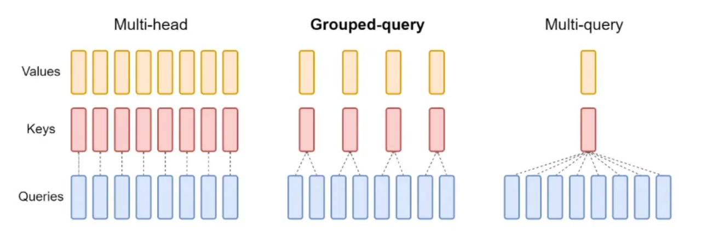

# 现代 CLM 模型结构详解

> 以 MiniMind 为例，对比经典 Transformer，逐一拆解现代因果语言模型（CLM）的关键组件。

---

## 一、全局结构对比


### 经典 Transformer（2017, Vaswani et al.）
- 建议基础八股必须看论文搞会，主包面试经常被问到其中细节

    - [非常好的原文学习资料](https://www.slideshare.net/slideshow/attention-is-all-you-need-transformer-241144565/241144565#4)

    - [沐神讲解视频](https://www.bilibili.com/video/BV1pu411o7BE/?share_source=copy_web&vd_source=c8ea1fe0b8ffd7d648f6be997c74de04)
    - [手撕 MHA](https://wl1uow62ws.feishu.cn/docx/Rwygd4uhyopFVNxl8Avcmn4Lnnf#share-UdJyd8rfcoxYWdxW34Pcfr22nNf)

```
输入 → Encoder（双向注意力）→ Decoder（交叉注意力）→ 输出
```

- **Encoder-Decoder** 双塔结构，适合翻译等 seq2seq 任务
- 位置编码：绝对正弦位置编码，加在 embedding 上
- 归一化：Post-Norm（残差之后做 LayerNorm）
- 注意力：每个 head 有独立的 Q/K/V，即 MHA
- FFN：`Linear → ReLU → Linear`，两层

### 现代 CLM（GPT/LLaMA/Qwen/MiniMind）


```
输入 → Decoder-Only（因果注意力，×N 层）→ 输出
```

- **仅 Decoder**，去掉 Encoder 和交叉注意力，专注自回归生成
- 位置编码：RoPE（旋转位置编码），编进注意力计算中
- 归一化：Pre-Norm（残差之前做 RMSNorm），训练更稳定
- 注意力：GQA（分组查询注意力），KV 头数 < Q 头数
- FFN：SwiGLU，三路门控结构

| 组件 | 经典 Transformer | 现代 CLM |
|---|---|---|
| 结构 | Encoder-Decoder | Decoder-Only |
| 位置编码 | 绝对正弦 | RoPE |
| 归一化位置 | Post-Norm | Pre-Norm |
| 归一化类型 | LayerNorm | RMSNorm |
| 注意力 | MHA | GQA |
| FFN 激活 | ReLU | SwiGLU |
| 因果遮罩 | 仅 Decoder 侧 | 全部层 |

---

## 二、关键组件详解

### 2.1 RMSNorm —— 更轻量的归一化

**经典 LayerNorm** 需要计算均值和方差两项统计量：

```python
# LayerNorm: y = (x - mean) / sqrt(var + eps) * weight + bias
```

**RMSNorm** 去掉均值中心化，只保留 RMS（均方根）缩放，计算量更小：

```python
# model/model_minimind.py
class RMSNorm(torch.nn.Module):
    def __init__(self, dim: int, eps: float = 1e-5):
        super().__init__()
        self.eps = eps
        self.weight = nn.Parameter(torch.ones(dim))

    def norm(self, x):
        # RMS = sqrt(mean(x^2))，用 rsqrt 避免开方再取倒数
        return x * torch.rsqrt(x.pow(2).mean(-1, keepdim=True) + self.eps)

    def forward(self, x):
        return (self.weight * self.norm(x.float())).type_as(x)
```

**Pre-Norm 用法**（在残差之前归一化，训练更稳定）：

```python
# model/model_minimind.py — MiniMindBlock.forward
residual = hidden_states
hidden_states, present_key_value = self.self_attn(
    self.input_layernorm(hidden_states),  # ← 先 Norm，再送入注意力
    ...
)
hidden_states += residual  # 残差连接
hidden_states = hidden_states + self.mlp(
    self.post_attention_layernorm(hidden_states)  # ← 同样 Pre-Norm
)
```

---

### 2.2 RoPE —— 旋转位置编码
[非常好科普视频](https://www.bilibili.com/video/BV1FjrCBdESo/?share_source=copy_web&vd_source=c8ea1fe0b8ffd7d648f6be997c74de04)

**绝对位置编码** 的缺点：位置向量加在 embedding 上，序列超出训练长度就失效。

**RoPE** 的核心思想：把位置信息编进 Q/K 的旋转变换中，使 `QK^T` 的点积自然包含相对位置差，且可以外推到更长序列。

```python
# model/model_minimind.py — 预计算旋转频率（离线，只算一次）
def precompute_freqs_cis(dim, end=32*1024, rope_base=1e6, rope_scaling=None):
    # 每个维度对应不同频率：θ_i = 1 / (base ^ (2i / dim))
    freqs = 1.0 / (rope_base ** (torch.arange(0, dim, 2).float() / dim))
    t = torch.arange(end)
    freqs = torch.outer(t, freqs)  # shape: [seq_len, dim/2]
    # 拼接 cos/sin，用于后续旋转
    freqs_cos = torch.cat([torch.cos(freqs), torch.cos(freqs)], dim=-1)
    freqs_sin = torch.cat([torch.sin(freqs), torch.sin(freqs)], dim=-1)
    return freqs_cos, freqs_sin

# 应用旋转：把 Q/K 的后半段取负，再分别乘 cos/sin
def apply_rotary_pos_emb(q, k, cos, sin, unsqueeze_dim=1):
    def rotate_half(x):
        return torch.cat((-x[..., x.shape[-1]//2:], x[..., :x.shape[-1]//2]), dim=-1)
    q_embed = (q * cos.unsqueeze(unsqueeze_dim)) + (rotate_half(q) * sin.unsqueeze(unsqueeze_dim))
    k_embed = (k * cos.unsqueeze(unsqueeze_dim)) + (rotate_half(k) * sin.unsqueeze(unsqueeze_dim))
    return q_embed.to(q.dtype), k_embed.to(k.dtype)
```

**YaRN 长度外推**：当推理序列超过训练长度时，对高频维度做线性插值，低频维度保持不变，使 32K 训练的模型可以推理更长序列（通过 `inference_rope_scaling` 开关控制）。

---

### 2.3 GQA —— 分组查询注意力


**MHA（Multi-Head Attention）**：每个注意力头都有独立 K/V，显存消耗随头数线性增长。

**GQA（Grouped Query Attention）**：多个 Q 头**共享**一组 K/V 头，大幅减少 KV Cache 显存。

```
MHA:  Q heads=8,  K heads=8,  V heads=8   → 8组KV
GQA:  Q heads=8,  K heads=4,  V heads=4   → 4组KV（本仓库默认）
MQA:  Q heads=8,  K heads=1,  V heads=1   → 1组KV（极致压缩）
```

```python
# model/model_minimind.py — Attention.__init__
self.n_local_heads = config.num_attention_heads      # Q 头数 = 8
self.n_local_kv_heads = config.num_key_value_heads   # KV 头数 = 4
self.n_rep = self.n_local_heads // self.n_local_kv_heads  # = 2，每组KV对应2个Q

self.q_proj = nn.Linear(hidden_size, 8 * head_dim)  # Q：8头
self.k_proj = nn.Linear(hidden_size, 4 * head_dim)  # K：4头（一半）
self.v_proj = nn.Linear(hidden_size, 4 * head_dim)  # V：4头（一半）

# 推理时把 KV 头复制 n_rep 次，对齐 Q 头数
def repeat_kv(x, n_rep):
    bs, slen, num_kv_heads, head_dim = x.shape
    if n_rep == 1: return x
    return x[:, :, :, None, :].expand(bs, slen, num_kv_heads, n_rep, head_dim) \
                               .reshape(bs, slen, num_kv_heads * n_rep, head_dim)
```

**KV Cache**：推理时缓存历史 K/V，每步只计算当前 token 的注意力，避免重复计算：

```python
# model/model_minimind.py — Attention.forward
if past_key_value is not None:
    xk = torch.cat([past_key_value[0], xk], dim=1)  # 历史K + 当前K
    xv = torch.cat([past_key_value[1], xv], dim=1)
past_kv = (xk, xv) if use_cache else None
```

---

### 2.4 SwiGLU FFN —— 门控前馈网络

**经典 FFN**：`Linear → ReLU → Linear`，两个矩阵。

**SwiGLU**：三个矩阵，用门控机制让模型选择性地激活特征：

```
output = down_proj( SiLU(gate_proj(x)) ⊙ up_proj(x) )
```

- `gate_proj(x)` 经过 SiLU 激活，产生"开关信号"
- `up_proj(x)` 产生"内容信号"
- 两者逐元素相乘（⊙），实现软性特征过滤

```python
# model/model_minimind.py — FeedForward
class FeedForward(nn.Module):
    def __init__(self, config, intermediate_size=None):
        super().__init__()
        intermediate_size = intermediate_size or config.intermediate_size
        self.gate_proj = nn.Linear(config.hidden_size, intermediate_size, bias=False)
        self.up_proj   = nn.Linear(config.hidden_size, intermediate_size, bias=False)
        self.down_proj = nn.Linear(intermediate_size, config.hidden_size, bias=False)
        self.act_fn = ACT2FN[config.hidden_act]  # SiLU

    def forward(self, x):
        # SwiGLU: gate 信号 ⊙ up 信号，再投影回原维度
        return self.down_proj(self.act_fn(self.gate_proj(x)) * self.up_proj(x))
```

`intermediate_size` 默认取 `ceil(hidden_size × π / 64) × 64`，约为 hidden_size 的 2.67 倍（比经典的 4 倍略小，但三个矩阵总参数量相近）。

---

### 2.5 MoE —— 稀疏混合专家


Dense 模型每个 token 经过**同一套** FFN；MoE 用 N 个 FFN（"专家"），每个 token 只激活其中 Top-M 个，**参数量大但计算量不变**。

```python
# model/model_minimind.py — MOEFeedForward
class MOEFeedForward(nn.Module):
    def __init__(self, config):
        super().__init__()
        # Router：一个线性层，输出每个专家的得分
        self.gate = nn.Linear(config.hidden_size, config.num_experts, bias=False)
        # N 个独立 FFN 专家
        self.experts = nn.ModuleList([FeedForward(config) for _ in range(config.num_experts)])

    def forward(self, x):
        x_flat = x.view(-1, x.shape[-1])           # 展平为 [batch*seq, hidden]
        scores = F.softmax(self.gate(x_flat), dim=-1)          # 路由得分
        topk_weight, topk_idx = torch.topk(scores, k=self.config.num_experts_per_tok)

        # 归一化 topk 权重（使各专家权重和为1）
        topk_weight = topk_weight / (topk_weight.sum(-1, keepdim=True) + 1e-20)

        y = torch.zeros_like(x_flat)
        for i, expert in enumerate(self.experts):
            mask = (topk_idx == i)
            if mask.any():
                token_idx = mask.any(dim=-1).nonzero().flatten()
                weight = topk_weight[mask].view(-1, 1)
                y.index_add_(0, token_idx, expert(x_flat[token_idx]) * weight)

        # 辅助负载均衡损失：避免所有 token 都选同一个专家
        if self.training:
            load = F.one_hot(topk_idx, self.config.num_experts).float().mean(0)
            self.aux_loss = (load * scores.mean(0)).sum() * \
                            self.config.num_experts * self.config.router_aux_loss_coef
        return y.view(x.shape)
```

**负载均衡损失**是 MoE 训练的关键：若没有约束，Router 会退化为总选固定几个专家，其他专家完全浪费。`aux_loss` 鼓励所有专家被均匀使用。

---

### 2.6 因果遮罩与 Flash Attention

CLM 的核心约束：每个 token 只能看到自己及之前的 token（不能看未来）。

```python
# model/model_minimind.py — Attention.forward
if self.flash and seq_len > 1:
    # Flash Attention：由 PyTorch 底层融合计算，节省显存，速度更快
    output = F.scaled_dot_product_attention(
        xq, xk, xv, dropout_p=self.dropout if self.training else 0.0,
        is_causal=self.is_causal   # ← 自动应用因果遮罩
    )
else:
    # 手动实现：分数矩阵上三角置 -inf，softmax 后上三角趋近于 0
    scores = (xq @ xk.transpose(-2, -1)) / math.sqrt(self.head_dim)
    scores[:, :, :, -seq_len:] += torch.full(
        (seq_len, seq_len), float("-inf"), device=scores.device
    ).triu(1)   # 上三角（不含对角线）填 -inf
    output = F.softmax(scores.float(), dim=-1) @ xv
```

---

## 三、整体数据流（以 Dense 模型为例）

```
input_ids [B, T]
    ↓  embed_tokens
hidden_states [B, T, 768]
    ↓  × 8 层 MiniMindBlock
    │   ├─ input_layernorm (RMSNorm)
    │   ├─ Attention (GQA + RoPE + 因果遮罩)
    │   ├─ 残差连接
    │   ├─ post_attention_layernorm (RMSNorm)(这是FFN的pre-norm)
    │   ├─ FeedForward (SwiGLU)
    │   └─ 残差连接
    ↓  norm (RMSNorm)
hidden_states [B, T, 768]
    ↓  lm_head (与 embed_tokens 权重共享)
logits [B, T, 6400]
    ↓  cross_entropy(logits[:, :-1], labels[:, 1:])
loss
```

**权重共享**：`lm_head.weight = embed_tokens.weight`，输入嵌入和输出投影用同一矩阵，减少约 5M 参数。

---

## 四、配置速查（默认 64M 参数）

| 参数 | 值 | 说明 |
|---|---|---|
| `hidden_size` | 768 | 每个 token 的向量维度 |
| `num_hidden_layers` | 8 | Transformer 层数 |
| `num_attention_heads` | 8 | Q 注意力头数 |
| `num_key_value_heads` | 4 | KV 头数（GQA） |
| `intermediate_size` | ~2560 | FFN 中间维度 |
| `max_position_embeddings` | 32768 | 最大上下文长度 |
| `vocab_size` | 6400 | 词表大小 |
| `rope_theta` | 1e6 | RoPE 基础频率 |
| `num_experts` | 4 | MoE 专家数（use_moe=True 时） |
| `num_experts_per_tok` | 1 | 每个 token 激活的专家数 |
